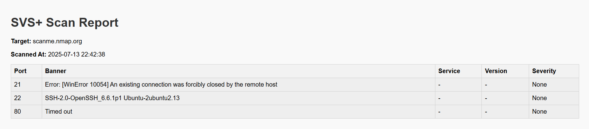

# 1. 🔐 SVS+ – Smart Vulnerability Scanner Plus

A lightweight, CLI-based cybersecurity tool for scanning open ports, detecting banners, and identifying vulnerable software versions — with severity tagging, export formats, and future AI support.
## 2. 🚀 Features

- 🔍 Port scanning with `socket`
- 📜 Banner grabbing from open services
- 📦 Version + vulnerability detection
- 🟥 Severity tags: High / Medium / Low
- 🧠 AI mode stub for future GPT analysis
- 📤 Report output: TXT, JSON, HTML
## 3. 🛠️ Installation

```bash
git clone https://github.com/<your-username>/SVS-Plus.git
cd SVS-Plus
pip install -r requirements.txt

---

### 🖥️ 4. How to Run

```markdown
## 🖥️ Usage

```bash
# Basic port scan
python core/scanner.py --ip scanme.nmap.org

# Scan with JSON export
python core/scanner.py --ip scanme.nmap.org --output json

# Use AI mode (stub)
python core/scanner.py --ip scanme.nmap.org --ai-mode

# Output as HTML
python core/scanner.py --ip scanme.nmap.org --output html

### 📄 5. Report Samples

```markdown
## 📄 Report Samples

Reports are saved to the `/reports/` folder in the following formats:
- `.txt` – human-readable CLI-style log
- `.json` – machine-readable structured output
- `.html` – styled, color-coded report for presentations


## 6. 🤖 AI Mode

`--ai-mode` will generate vulnerability prompts based on banner detection like:

```txt
🧠 Would ask AI about: openssh 6.6.1p1

### 📁 7. Project Structure

```markdown
## 📁 Folder Structure

## ✍️ Author

Developed by **Ashutosh Choudhary** as part of a cybersecurity learning project 💻🛡️  
Contact: [LinkedIn or email if you want]

